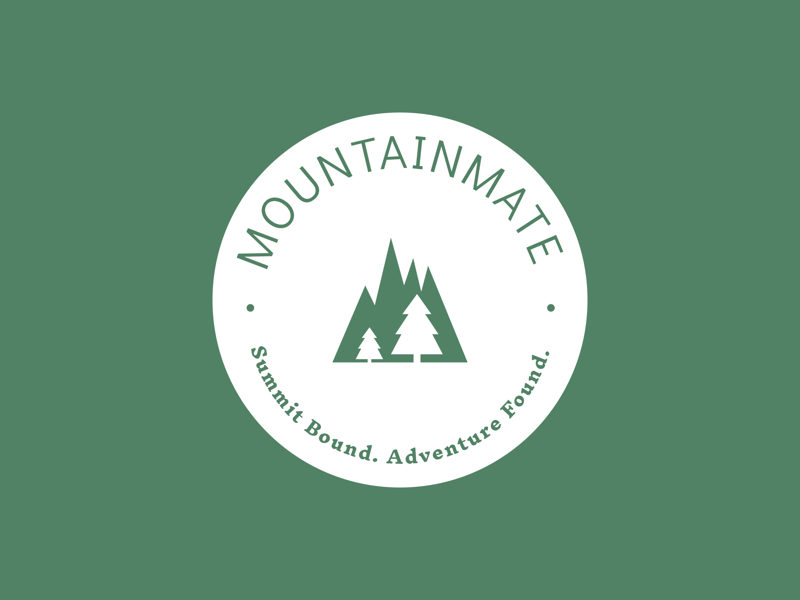
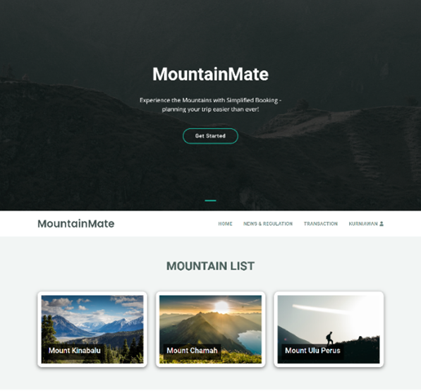

# 🏔️ Hiking Management System



> A web-based hiking management system built for the Forestry Service to digitalize mountain climbing reservations and administration. Developed as a Final Year Project (Bachelor's Degree) in 2023.

---

## 📋 Background

The previous system was fully manual — bookings were made via phone calls and registration could only be done on-site, making the process inefficient for both administrators and climbers. This system was built to digitalize the entire process, from mountain information to online booking and payment confirmation.

---

## 📸 Screenshots

> Create a `/docs/screenshots/` folder in this repo, upload your screenshots, then update the paths below.

**Landing Page**


**Mountain Detail**


**Booking / Reservation**


**Payment Upload**


**Admin Dashboard**


**Admin — Manage Mountains**


---

## ✨ Features

### Climber (User)
- 🔐 **Authentication** — register, login, and email verification
- 🏔️ **Mountain Information** — browse available mountains and hiking details
- 📰 **News & Regulations** — view official regulations from the Forestry Service
- 📅 **Online Booking** — create a hiking reservation and form a climbing group
- 👥 **Group Management** — create and manage climbing group members
- 💳 **Payment** — upload proof of payment for reservations
- 📋 **My Reservations** — track personal booking status

### Admin / Forestry Service Officer
- 📊 **Dashboard** — overview of reservations, payments, and climbers
- 🏔️ **Mountain Management** — add, edit, and delete mountain data
- 🛤️ **Trail Management** — manage hiking trails and route details
- 📰 **Regulation & News** — manage official announcements and regulations
- 💰 **Payment Confirmation** — verify and confirm climber payments
- 👤 **User & Role Management** — manage user accounts and roles
- 📈 **Reports & Analytics** — climbing data reports and charts

---

## 👥 User Roles

| Role | Description |
|------|-------------|
| **Admin** | Forestry Service officer — manages mountains, regulations, payments, and users |
| **Climber** | Registered user — browses mountains, creates bookings, and manages their group |

---

## 🛠️ Tech Stack

| Category | Technology |
|----------|------------|
| Backend | PHP 8.1, Laravel 10 |
| Templating | Blade |
| Frontend | Bootstrap 5.2, Sass, Axios |
| Bundler | Vite |
| Database | MySQL |
| Auth | Laravel Sanctum, Laravel UI |
| Search | Laravel Scout |
| Export | Maatwebsite Excel |
| Alerts | SweetAlert2 (realrashid/sweet-alert) |
| Methodology | Waterfall |

---

## ⚙️ Installation & Setup

### Prerequisites
- PHP >= 8.1
- Composer
- MySQL
- Node.js & NPM

### Steps

```bash
# 1. Clone the repository
git clone https://github.com/prayoga01/hiking-management-system.git
cd hiking-management-system

# 2. Install PHP dependencies
composer install

# 3. Install frontend dependencies
npm install && npm run dev

# 4. Copy environment file
cp .env.example .env

# 5. Generate app key
php artisan key:generate

# 6. Configure database in .env
DB_DATABASE=your_database_name
DB_USERNAME=your_username
DB_PASSWORD=your_password

# 7. Run migrations & seeders
php artisan migrate --seed

# 8. Start the server
php artisan serve
```

Access the app at `http://localhost:8000`

---

## 📁 Project Structure

```
hiking-management-system/
├── app/
│   └── Http/Controllers/
│       ├── MountainController.php
│       ├── MountainAbleController.php
│       ├── RegulationController.php
│       ├── PaymentController.php
│       └── RoleController.php
├── database/
│   ├── migrations/
│   └── seeders/
├── resources/
│   ├── views/
│   │   ├── admin/
│   │   └── user/
│   └── sass/
├── routes/
│   └── web.php
└── .env.example
```

---

## 🔄 Development Methodology

This project was developed using the **Waterfall** methodology:

| Phase | Description |
|-------|-------------|
| 1. Requirement Analysis | System needs analysis |
| 2. Design | UI wireframes, UML diagrams (Use Case, Activity, Sequence, Class) |
| 3. Development | Coding with Laravel + MySQL |
| 4. Testing | Unit testing per feature via browser |
| 5. Maintenance | Bug fixing and system improvements |

---

## 👨‍💻 Developer

**Yoga Pratama** — Final Year Project, Bachelor's Degree 2023
- GitHub: [@prayoga01](https://github.com/prayoga01)

---

## 📝 License

This project was developed as a Final Year Project (Bachelor's Degree) in 2023.
