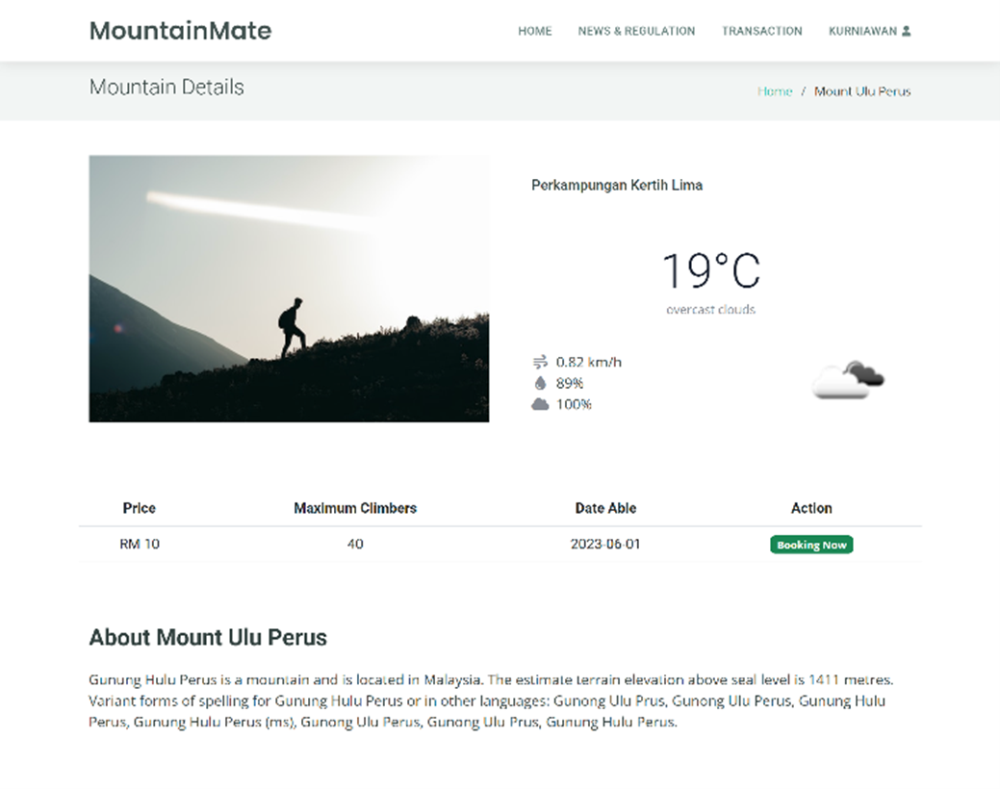
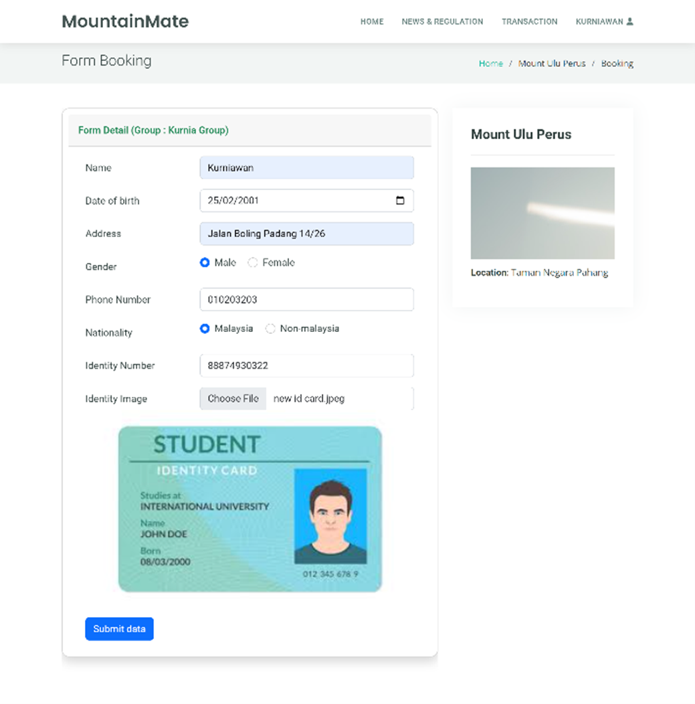
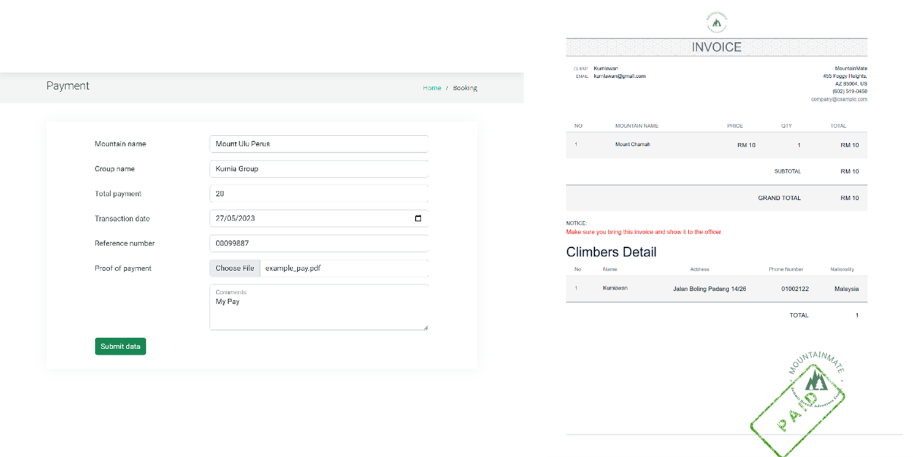
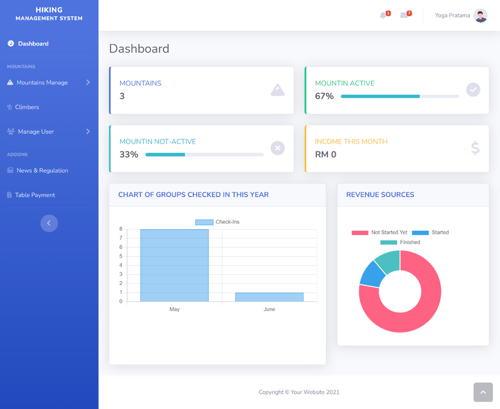
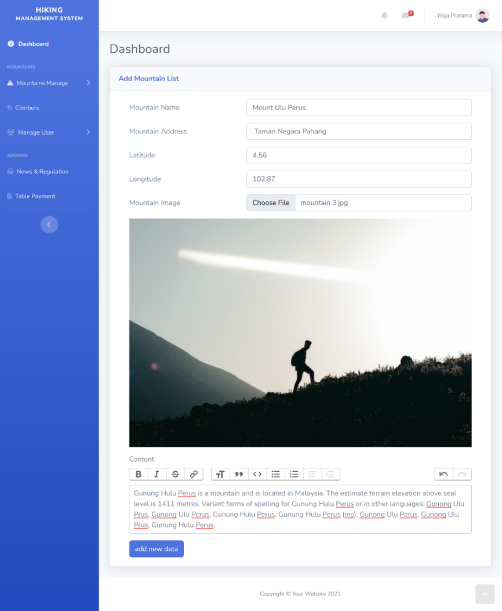

# 🏔️ Hiking Management System


> A web-based hiking management system built for the Forestry Service to digitalize mountain climbing reservations and administration. Developed as a Final Year Project (Bachelor's Degree) in 2023.

---

## 📋 Background

The previous system was fully manual — bookings were made via phone calls and registration could only be done on-site, making the process inefficient for both administrators and climbers. This system was built to digitalize the entire process, from mountain information to online booking and payment confirmation.

---

## 📸 Screenshots

**Mountain Detail**

The mountain detail page provides comprehensive information to support users in planning their hikes. When a user selects a mountain image from the landing page, they are directed to a detail page that displays key information such as the mountain’s image, weather forecast, climbing dates, maximum number of climbers, and availability status. The page also includes a short review of the mountain. To check availability, users can refer to the "action" column: if it displays "booking now," the mountain is open for reservations. If the mountain has been deactivated by the administrator, the "booking now" button will change to "not able for now," indicating that the mountain is temporarily unavailable.

**Booking / Reservation**

The form booking feature enables users to reserve a climbing schedule by completing the required form with accurate details. Alongside the form, the page also displays a brief overview of the selected mountain on the right side, including the mountain’s image and location. After the user fills in the necessary information and clicks the submit button, the system will display a success alert to confirm that the booking has been submitted.

**Payment Upload**

The invoice feature provides users with a clear overview of their booking status. On this page, users can view detailed information about their order along with its current status.

**Admin Dashboard**

The dashboard adminpage serves as a centralized dashboard that provides administrators with key information and management tools. It features a notification bell that alerts the admin whenever a new transaction occurs, allowing quick access to updates. The page also displays important data, including the total number of mountains, the number of active and inactive mountains, and the earnings for the current month. With these features, the admin page offers comprehensive access to manage transactions and gain valuable insights into mountain management.

**Admin — Manage Mountains**

Manage Mountain admin, page provides staff with a simple and structured interface to input new mountain data. Through this page, staff can complete a form with essential details such as the mountain’s name, address, longitude, latitude, image, and description. Accurate input of longitude and latitude is particularly important to ensure the weather forecast displayed is correct. The interface is designed to be user-friendly, guiding staff step by step in adding and managing mountain information effectively.
---

## ✨ Features

### Climber (User)
- 🔐 **Authentication** — register, login, and email verification
- 🏔️ **Mountain Information** — browse available mountains and hiking details
- 📰 **News & Regulations** — view official regulations from the Forestry Service
- 📅 **Online Booking** — create a hiking reservation and form a climbing group
- 👥 **Group Management** — create and manage climbing group members
- 💳 **Payment** — upload proof of payment for reservations
- 📋 **My Reservations** — track personal booking status

### Admin / Forestry Service Officer
- 📊 **Dashboard** — overview of reservations, payments, and climbers
- 🏔️ **Mountain Management** — add, edit, and delete mountain data
- 🛤️ **Trail Management** — manage hiking trails and route details
- 📰 **Regulation & News** — manage official announcements and regulations
- 💰 **Payment Confirmation** — verify and confirm climber payments
- 👤 **User & Role Management** — manage user accounts and roles
- 📈 **Reports & Analytics** — climbing data reports and charts

---

## 👥 User Roles

| Role | Description |
|------|-------------|
| **Admin** | Forestry Service officer — manages mountains, regulations, payments, and users |
| **Climber** | Registered user — browses mountains, creates bookings, and manages their group |

---

## 🛠️ Tech Stack

| Category | Technology |
|----------|------------|
| Backend | PHP 8.1, Laravel 10 |
| Templating | Blade |
| Frontend | Bootstrap 5.2, Sass, Axios |
| Bundler | Vite |
| Database | MySQL |
| Auth | Laravel Sanctum, Laravel UI |
| Search | Laravel Scout |
| Export | Maatwebsite Excel |
| Alerts | SweetAlert2 (realrashid/sweet-alert) |
| Methodology | Waterfall |

---

## ⚙️ Installation & Setup

### Prerequisites
- PHP >= 8.1
- Composer
- MySQL
- Node.js & NPM

### Steps

```bash
# 1. Clone the repository
git clone https://github.com/prayoga01/hiking-management-system.git
cd hiking-management-system

# 2. Install PHP dependencies
composer install

# 3. Install frontend dependencies
npm install && npm run dev

# 4. Copy environment file
cp .env.example .env

# 5. Generate app key
php artisan key:generate

# 6. Configure database in .env
DB_DATABASE=your_database_name
DB_USERNAME=your_username
DB_PASSWORD=your_password

# 7. Run migrations & seeders
php artisan migrate --seed

# 8. Start the server
php artisan serve
```

Access the app at `http://localhost:8000`

---

## 📁 Project Structure

```
hiking-management-system/
├── app/
│   └── Http/Controllers/
│       ├── MountainController.php
│       ├── MountainAbleController.php
│       ├── RegulationController.php
│       ├── PaymentController.php
│       └── RoleController.php
├── database/
│   ├── migrations/
│   └── seeders/
├── resources/
│   ├── views/
│   │   ├── admin/
│   │   └── user/
│   └── sass/
├── routes/
│   └── web.php
└── .env.example
```

---

## 🔄 Development Methodology

This project was developed using the **Waterfall** methodology:

| Phase | Description |
|-------|-------------|
| 1. Requirement Analysis | System needs analysis |
| 2. Design | UI wireframes, UML diagrams (Use Case, Activity, Sequence, Class) |
| 3. Development | Coding with Laravel + MySQL |
| 4. Testing | Unit testing per feature via browser |
| 5. Maintenance | Bug fixing and system improvements |

---

## 👨‍💻 Developer

**Yoga Pratama** — Final Year Project, Bachelor's Degree 2023
- GitHub: [@prayoga01](https://github.com/prayoga01)

---

## 📝 License

This project was developed as a Final Year Project (Bachelor's Degree) in 2023.
